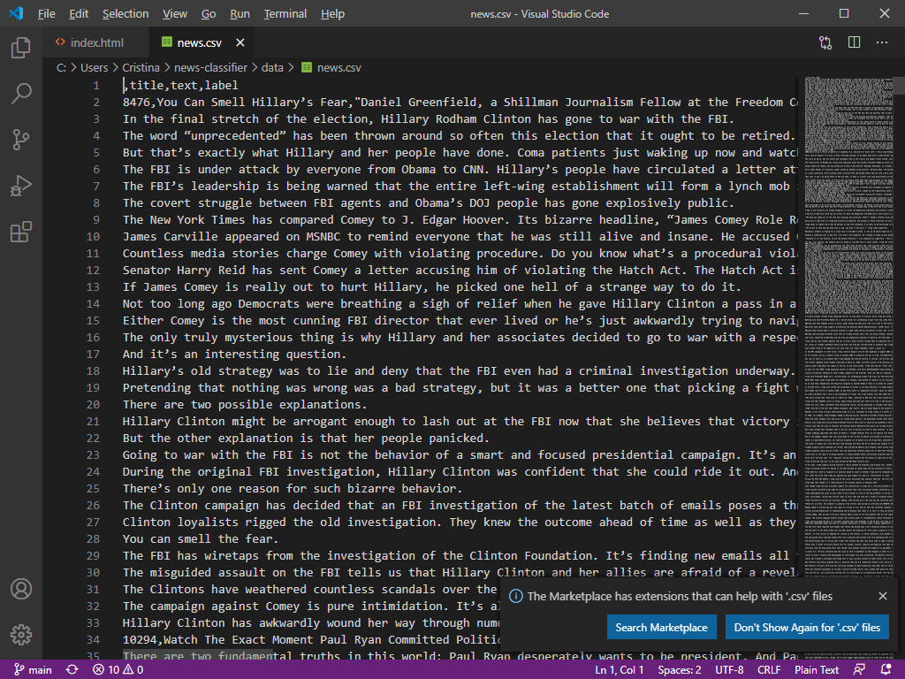

# News Classifier

  _Tools:  Python, Numpy, Pandas, Itertools, Sklearn_

## Summary

In this research project we took a political dataset ([news.csv]("/data/news.csv")) from the 2016 US Presidential elections and created a machine learning model using Python to classify the news as REAL or FAKE. We implemented a TfidfVectorizer, initialized a PassiveAggressiveClassifier, and fit our model. Finally, we run an uncertainty evaluation of the model to obtain the level of accuracy.



## Introduction

It is important before getting into the codes declare a set of  terms and defitions. For this project I am interpreting the following terms as follows:

+ Fake News: News items may contain false and/or exaggerated claims, and may end up being viralized by algorithms, and users may end up in a filter bubble. 

+ tfidfvectorizer:  Composed by 2 terms. 
    - TF (Term Frequency): The number of times a word appears in a document is its Term Frequency; 
    - IDF (Inverse Document Frequency): Words that occur many times a document, but also occur many times in many others, may be irrelevant.
    
    <em>The TfidfVectorizer converts a collection of raw documents into a matrix of TF-IDF features.</em>

+ PassiveAggressive Classifier: Online learning algorithms. Such an algorithm remains passive for a correct classification outcome, and turns aggressive in the event of a miscalculation,

## Situation

Modeling a classifier of news as "REAL" or  "FAKE"

## Tasks

* Use sklearn to build a TfidfVectorizer on the dataset. 
* Initialize a PassiveAggressive Classifier and fit the model. 
* Evaluate the model using the accuracy score and the confusion matrix.

## The Dataset

The dataset we’ll use for this python project- we’ll call it <em>news.csv</em>. 

This dataset has a shape of 7796×4. The first column identifies the news, the second and third are the title and text, and the fourth column has labels denoting whether the news is REAL or FAKE. 

Import all the needed Libraries


```python
import numpy as np
import pandas as pd
import itertools
from sklearn.model_selection import train_test_split
from sklearn.feature_extraction.text import TfidfVectorizer
from sklearn.linear_model import PassiveAggressiveClassifier
from sklearn.metrics import accuracy_score, confusion_matrix
```

Read the data into a DataFrame, and get the shape of the data and the first 5 records.


```python
#Read the data
df=pd.read_csv("data/news.csv")

#Get shape and head
df.shape
df.head()
```


<div>
<style scoped>
    .dataframe tbody tr th:only-of-type {
        vertical-align: middle;
    }

    .dataframe tbody tr th {
        vertical-align: top;
    }

    .dataframe thead th {
        text-align: right;
    }
</style>
<table border="1" class="dataframe">
  <thead>
    <tr style="text-align: right;">
      <th></th>
      <th>Unnamed: 0</th>
      <th>title</th>
      <th>text</th>
      <th>label</th>
    </tr>
  </thead>
  <tbody>
    <tr>
      <th>0</th>
      <td>8476</td>
      <td>You Can Smell Hillary’s Fear</td>
      <td>Daniel Greenfield, a Shillman Journalism Fello...</td>
      <td>FAKE</td>
    </tr>
    <tr>
      <th>1</th>
      <td>10294</td>
      <td>Watch The Exact Moment Paul Ryan Committed Pol...</td>
      <td>Google Pinterest Digg Linkedin Reddit Stumbleu...</td>
      <td>FAKE</td>
    </tr>
    <tr>
      <th>2</th>
      <td>3608</td>
      <td>Kerry to go to Paris in gesture of sympathy</td>
      <td>U.S. Secretary of State John F. Kerry said Mon...</td>
      <td>REAL</td>
    </tr>
    <tr>
      <th>3</th>
      <td>10142</td>
      <td>Bernie supporters on Twitter erupt in anger ag...</td>
      <td>— Kaydee King (@KaydeeKing) November 9, 2016 T...</td>
      <td>FAKE</td>
    </tr>
    <tr>
      <th>4</th>
      <td>875</td>
      <td>The Battle of New York: Why This Primary Matters</td>
      <td>It's primary day in New York and front-runners...</td>
      <td>REAL</td>
    </tr>
  </tbody>
</table>
</div>


Now, let's extract and get the labels from the DataFrame.


```python
#DataFlair - Get the labels
labels=df.label
labels.head()
```


    0    FAKE
    1    FAKE
    2    REAL
    3    FAKE
    4    REAL
    Name: label, dtype: object


After the definition of the classifiers, Split the dataset into training and testing sets.


```python
#DataFlair - Split the dataset
x_train,x_test,y_train,y_test=train_test_split(df['text'], labels, test_size=0.2, random_state=7)
```

Initialize a TfidfVectorizer with stop words from the English language and a maximum document frequency of 0.7:

* (terms with a higher document frequency will be discarded).

* Stop words need to be filtered out before processing the natural language data. 

* TfidfVectorizer turns a collection of raw documents into a matrix of TF-IDF features.


```python
#DataFlair - Initialize a TfidfVectorizer
tfidf_vectorizer=TfidfVectorizer(stop_words='english', max_df=0.7)

#DataFlair - Fit and transform train set, transform test set
tfidf_train=tfidf_vectorizer.fit_transform(x_train) 
tfidf_test=tfidf_vectorizer.transform(x_test)
```

Initialize a PassiveAggressiveClassifier. 

Work sequence:

* Fit this on tfidf_train and y_train.
* Predict on the test set from the TfidfVectorizer
* Calculate the accuracy with accuracy_score() from sklearn.metrics.


```python
#DataFlair - Initialize a PassiveAggressiveClassifier
pac=PassiveAggressiveClassifier(max_iter=50)
pac.fit(tfidf_train,y_train)

#DataFlair - Predict on the test set and calculate accuracy
y_pred=pac.predict(tfidf_test)
score=accuracy_score(y_test,y_pred)
print(f'Accuracy: {round(score*100,2)}%')
```

    Accuracy: 92.42%
    

The accuracy of the model is 92.42%. Now once we defined this charatceristic we are ready to print a cond=fusion matrix to get a better insgihts into the ocurrency of false and true negatives and positives.


```python
#DataFlair - Build confusion matrix
confusion_matrix(y_test,y_pred, labels=['FAKE','REAL'])
```


    array([[588,  50],
           [ 46, 583]], dtype=int64)


## Results

1. With model we have:
    + True Positives = 589
    + False Positive = 42
    + True Negatives =587
    + False Negatives = 49


## Conclusions

1. With Python to we created a model which is able to detect fake news. 
2. We took a political dataset, 
3. We implemented a TfidfVectorizer, initialized a PassiveAggressiveClassifier, and fit our model.
3. We ended up obtaining an accuracy of 92.82% in magnitude.


